## OpenEBS Local PV LVM

## Overview

OpenEBS Local PV LVM is a [CSI](https://github.com/container-storage-interface/spec) plugin for implementation of [LVM](https://en.wikipedia.org/wiki/Logical_Volume_Manager_(Linux)) backed persistent volumes for Kubernetes. It is a local storage solution, which means the device, volume and the application are on the same host. It doesn't contain any dataplane, i.e only its simply a control-plane for the kernel lvm volumes. It mainly comprises of two components which are implemented in accordance to the CSI Specs:

1. CSI Controller - Frontends the incoming requests and initiates the operation.
2. CSI Node Plugin - Serves the requests by performing the operations and making the volume available for the initiator.

## Why OpenEBS Local PV LVM?

1. Lightweight, easy to set up storage provisoner for host-local volumes in K8s ecosystem.
2. Makes LVM stack available to K8s, allowing end users to use the LVM functionalites like snapshot, thin provisioning, resize, etc for their Persistent Volumes.
3. Cloud native, i.e based on CSI spec, hence suitable for all K8s deployments.

## Architecture

LocalPV refers to storage that is directly attached to a specific node in the Kubernetes cluster. It uses locally available disks (e.g., SSDs, HDDs) on the node.

<b>Use Case</b>: Ideal for workloads that require low-latency access to storage or when data locality is critical (e.g., databases, caching systems).

### Characteristics:

- <b>Node-bound</b>: The volume is tied to the node where the disk is physically located.
- <b>No replication</b>: Data is not replicated across nodes, so if the node fails, the data may become inaccessible.
- <b>High performance</b>: Since the storage is local, it typically offers lower latency compared to network-attached storage.

The diagram below depicts the mapping to the host disks, the LVM stack on top of the disks and the kubernetes persistent volumes to be consumed by the workload. Local PV LVM CSI Controller upon creation of the Persistent Volume Claim, creates a LVMVolume CR, which emits an event for Local PV LVM CSI Node Plugin to create the LV(logical volume). When workloads are scheduled the Local PV LVM CSI Node Plugin makes this zvol/dataset available via a mount point on the host.

```mermaid
graph TD;
  subgraph Node2["Node 2"]
    subgraph K8S_NODE1[" "]
      N1_PV1["PV"] --> N1_APP1["APP"]
      N1_PV2["PV"] --> N1_APP2["APP"]
    end
    subgraph LVM_Stack2["LVM Stack"]
      P1_1["PV"] --> V1_1["VG"]
      P1_2["PV"] --> V1_1
      V1_1 --> L1_1["LV"]
      V1_1 --> L3_1["LV"]
      L1_1 --> N1_PV1 
      L3_1 --> N1_PV2
    end
    subgraph Blockdevices1[" "]
      D1["/dev/sdc"] --> P1_1
      D2["/dev/sdb"] --> P1_2
    end
  end

  subgraph Node1["Node 1"]
    subgraph K8S_NODE2[" "]
      N2_PV1["PV"] --> N2_APP1["APP"]
    end
    subgraph LVM_Stack1["LVM Stack"]
      P2_2["PV"] --> V2_2["VG"]
      V2_2 --> Z2_2["LV"]
      Z2_2 --> N2_PV1 
    end
    subgraph Blockdevices2[" "]
      D3["/dev/sdb"] --> P2_2
    end
  end

  classDef pv fill:#FFCC00,stroke:#FF9900,color:#000;
  classDef app fill:#99CC00,stroke:#66CC00,color:#000;
  classDef disk fill:#FF6666,stroke:#FF3333,color:#000;
  classDef vg fill:#FFCCFF,stroke:#FF99FF,color:#000;
  classDef lv fill:#99CCFF,stroke:#6699FF,color:#000;

  class N1_PV1,N1_PV2,N2_PV1 pv;
  class N1_APP1,N1_APP2,N2_APP1 app;
  class D1,D2,D3 disk;
  class P1_1,P1_2,P2_2 vg;
  class V1_1,V2_2 lv;
  class L1_1,L3_1,Z2_2 lv;

```

## Supported System

> | Name | Version |
> | :--- | :--- |
> | K8S | 1.23+ |
> | Distro | Alpine, Arch, CentOS, Debian, Fedora, NixOS, SUSE, Talos, RHEL, Ubuntu |
> | Kernel | oldest supported kernel is 2.6 |
> | LVM2 | 2.03.21 |
> | Min RAM | LVM2 is a kernel native module. It is very efficent and fast. It has no strict memory requirements |
> Stability | LVM2 is extremly stable and very mature. The Kernel was released ~2005. It exists in most LINUX distros |

## Documents

- [Prerequisites](./docs/quickstart.md#prerequisites)
- [Quickstart](./docs/quickstart.md#setup)
- [Developer Setup](./docs/developer-setup.md#development-workflow)
- [Testing](./docs/developer-setup.md#testing)
- [Contibuting Guidelines](./CONTRIBUTING.md)
- [Governance](./GOVERNANCE.md)
- [Changelog](./CHANGELOG.md)
- [Release Process](./RELEASE.md)

Features
---

- [x] Access Modes
    - [x] ReadWriteOnce
    - ~~ReadOnlyMany~~
    - ~~ReadWriteMany~~
- [x] Volume modes
    - [x] `Filesystem` mode
    - [x] [`Block`](docs/raw-block-volume.md) mode
- [x] Supports fsTypes: `ext4`, `btrfs`, `xfs`
- [x] Volume metrics
- [x] Topology
- [x] Snapshot
    - [x] [Create](docs/snapshot.md)
    - [ ] Restore
- [ ] Clone
- [x] [Volume Resize](docs/resize.md)
- [x] [Thin Provision](docs/thin_provision.md)
- [ ] Backup/Restore
- [ ] Ephemeral inline volume

## Limitation

- Resize of volumes with snapshot is not supported.
- Restore of a volume from snapshot is not supported.
- Clone of a volume from volume is not supported.

## Dev Activity dashboard

## License Compliance

## OpenEBS is a [CNCF Sandbox Project](https://www.cncf.io/projects/openebs)

